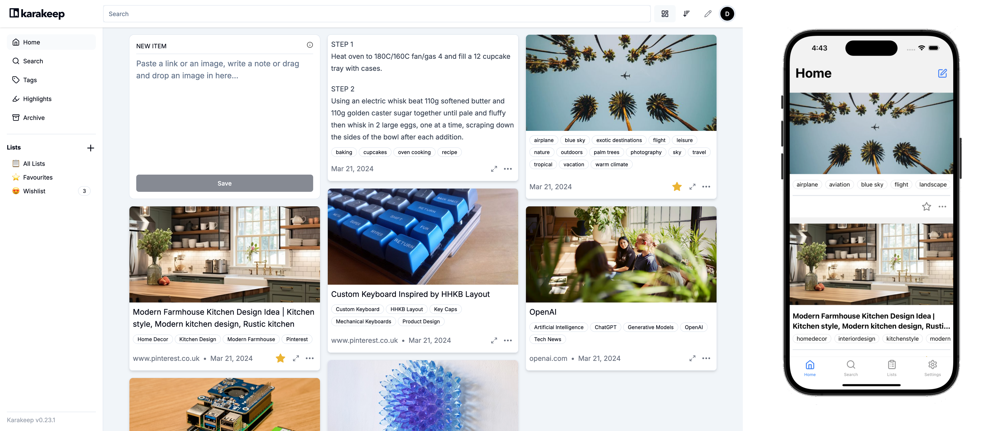
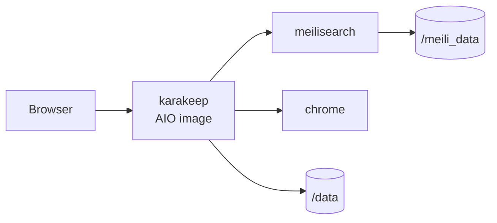

<div align="center">

# Karakeep on Render

Deploy **Karakeep**, the self-hosted bookmark and read-it-later app, on Render with the official GHCR AIO image, Meilisearch, and headless Chrome.

<p>
  <a href="https://render.com/deploy-template/api/github/start?template_repo=karakeep-render-template">
    
  </a>
</p>

<p>
  <a href="https://render.com">
    
  </a>
  <a href="https://github.com/karakeep-app/karakeep">
    
  </a>
  <a href="https://github.com/karakeep-app/karakeep/pkgs/container/karakeep">
    
  </a>
</p>

</div>



## What This Template Shows

This repo is a thin Render packaging of Karakeep's official AIO image plus Meilisearch and Chrome sidecars. Small Dockerfiles adapt entrypoint / Chrome flags only; no monorepo build.

| Piece | Role |
| --- | --- |
| **[Karakeep](https://github.com/karakeep-app/karakeep)** | Bookmarks, archives, search, AI tagging |
| **[ghcr.io/karakeep-app/karakeep](https://github.com/karakeep-app/karakeep/pkgs/container/karakeep)** | Official AIO image (via thin Dockerfile) |
| **[Meilisearch](https://www.meilisearch.com/)** | Full-text search (`getmeili/meilisearch`) |
| **Chrome** | Headless crawler / screenshots (digest-pinned official Karakeep Chrome) |
| **[Render Disk](https://render.com/docs/disks)** | SQLite + data at `/data`; Meili data at `/meili_data` |

## Architecture



### How It Works

1. Click **Deploy to Render**. Render forks this template and applies [`render.yaml`](./render.yaml).
2. Render builds thin Docker wrappers (AIO + Chrome) and pulls Meilisearch.
3. Open the `karakeep` URL and create an account.
4. Optionally add `OPENAI_API_KEY` in the Dashboard for AI tagging.
5. Save bookmarks; search and archives use Meilisearch + Chrome over the private network.

| Resource | Type | Plan | Notes |
| --- | --- | --- | --- |
| `karakeep` | Web (`runtime: docker`) | **starter** | AIO image; health `/api/health`; 5 GB disk |
| `meilisearch` | Private (`runtime: image`) | **starter** | 1 GB disk |
| `chrome` | Private (`runtime: docker`) | **starter** | Remote debugging on `9222` |

Default region: **oregon**. Previews are off. LLM keys are not required at Apply time.

### Chrome runtime and recovery

The Chrome wrapper pins the stable Karakeep-tested `151.0.7922.47-r1` image by
immutable digest. It inherits the image's non-root user and startup script.
Keep the Render start-command override empty: the inherited script manages an
internal browser port and exposes CDP on private port `9222`. Do not add
`chromium-browser`, `USER chrome` or `--remote-debugging-port` overrides.
See the [official migration contract](https://github.com/karakeep-app/karakeep/blob/v0.33.2/docs/docs/06-administration/09-chrome-image-migration.md).

The `Chrome sidecar` workflow builds the exact Linux image and verifies CDP,
JavaScript execution and a PNG screenshot against an in-memory fixture. It
does not crawl an external site or call an AI provider. After deploying only
the Chrome service, run `CHROME_URL=http://<private-chrome-host>:9222 node
scripts/chrome-smoke.mjs` from a Node 22+ environment with access to the Render
private network, and verify one existing Karakeep saved-page crawl.

This change requires no app, database or search migration. Keep the current
Karakeep and Meilisearch images, disks, environment and activation settings.
Before a future browser upgrade, preserve the last verified image digest and
service configuration for rollback. The original deployment recorded a failed
build, so it is not a known-good rollback target. A failed candidate should
remain unpromoted until the hosted smoke and private-network checks pass.

## Quick Start

### Prerequisites

- A [Render account](https://dashboard.render.com/register?utm_source=github&utm_medium=referral&utm_campaign=ojus_demos&utm_content=readme_link)
- Optional: OpenAI API key for AI tagging

### Deploy

1. Click **Deploy to Render** above and fork into your GitHub account.
2. On Apply, leave `OPENAI_API_KEY` blank unless you want AI tagging immediately.
3. Wait until services are **Live** (~5–10 minutes).
4. Open the `karakeep` URL and finish signup.
5. Add bookmarks; optionally set `OPENAI_API_KEY` later in the Dashboard.

Health check:

```bash
curl -sS https://<your-karakeep>.onrender.com/api/health
```

## Features

| Feature | Description |
| --- | --- |
| **Official AIO image** | Thin wrapper around GHCR Karakeep |
| **Search + crawl** | Meilisearch + headless Chrome private services |
| **Persistent SQLite** | 5 GB disk at `/data` |
| **Generated secrets** | `NEXTAUTH_SECRET`, `MEILI_MASTER_KEY` |
| **Optional AI** | `OPENAI_API_KEY` after deploy |

## Configuration

| Variable | Source | Description |
| --- | --- | --- |
| `MEILI_MASTER_KEY` | Auto-generated (group) | Shared Meilisearch key |
| `NEXTAUTH_SECRET` | Auto-generated | Auth sessions |
| `NEXTAUTH_URL` | Wired | From `karakeep` public URL |
| `DATA_DIR` | Wired | `/data` |
| `MEILI_HOST` / `MEILI_PORT` | Wired | Meilisearch private host + `7700` (entrypoint builds `MEILI_ADDR`) |
| `BROWSER_WEB_HOST` / `BROWSER_WEB_PORT` | Wired | Chrome private host + `9222` (entrypoint builds `BROWSER_WEB_URL`) |
| `DB_WAL_MODE` | Wired | `true` |
| `MEILI_NO_ANALYTICS` | Wired | `true` on Meilisearch |
| `OPENAI_API_KEY` | Optional (`sync: false`) | AI tagging; leave blank at Apply |

## Cost

| Resource | Approx. monthly |
| --- | ---: |
| `karakeep` (Starter) | ~$7 |
| `meilisearch` (Starter) | ~$7 |
| `chrome` (Starter) | ~$7 |
| Disks (6 GB total) | ~$1.50 |
| **Total** | **~$24–28** |

Bump `karakeep` to **Standard** if you OOM on large imports or heavy crawling.

## Troubleshooting

| Problem | Solution |
| --- | --- |
| Health check fails / no open ports | Keep Starter+; check disk mount at `/data` and logs for Meili connectivity. |
| Search empty / crawl fails | Confirm `meilisearch` and `chrome` are Live; `BROWSER_WEB_HOST` wiring. |
| AI tagging missing | Set `OPENAI_API_KEY` in Dashboard → Environment. |
| Data lost after redeploy | Disks must remain attached (`/data`, `/meili_data`). |

## Project Structure

```
render.yaml                 Render Blueprint
README.md                   This file
LICENSE                     MIT (template wrapper)
.env.example                Optional notes
assets/                     Hero
docker/Dockerfile.render-*  Thin image wrappers
docker/render-entrypoint.sh Builds BROWSER_WEB_URL from Render host
```

## Learn More

**Render:**
- [Web Services](https://render.com/docs/web-services)
- [Private Services](https://render.com/docs/private-services)
- [Disks](https://render.com/docs/disks)
- [Blueprints](https://render.com/docs/infrastructure-as-code)

**Karakeep:**
- [Upstream repo](https://github.com/karakeep-app/karakeep)
- [GHCR package](https://github.com/karakeep-app/karakeep/pkgs/container/karakeep)

## License

[MIT](LICENSE) for this template wrapper.

Upstream [Karakeep](https://github.com/karakeep-app/karakeep) license: see upstream repo. Star that project if this helped.
